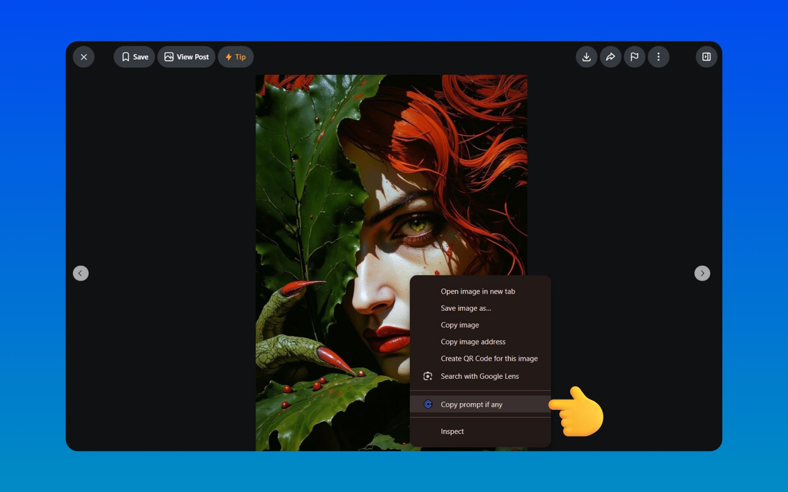
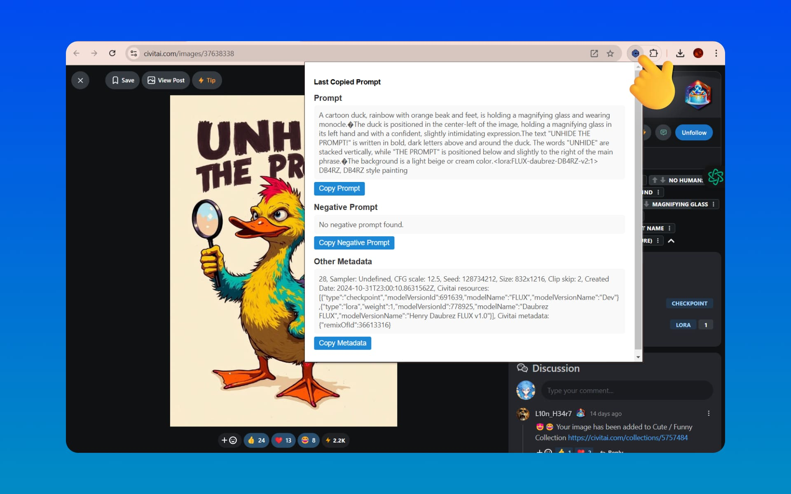
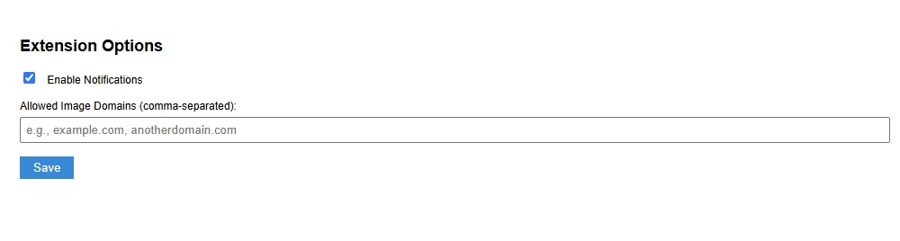

# ExcaliburAI - Civitai Prompt Extractor [v2.0.2]


**ExcaliburAI - Civitai Prompt Extractor** is a browser extension for AI artists, prompt researchers, and curious creators who want to recover the useful positive prompt hidden inside an AI-generated image.

Right-click an image, choose **Copy Prompt If Any**, and the prompt is copied to your clipboard in one click. Open the popup when you want to review the current result, see its character count, or copy it again.

## 📄 Table of Contents

- [🎉 What is new](#-what-is-new)
- [📖 Features](#-features)
- [🧩 Metadata support](#-metadata-support)
- [🚀 Manual installation](#-manual-installation)
- [🖥️ Usage](#️-usage)
- [⚙️ Configuration](#️-configuration)
- [🔒 Privacy Policy](#-privacy-policy)
- [📸 Screenshots](#-screenshots)
- [🔧 Development](#-development)
- [🧭 Backlog and limitations](#-backlog-and-limitations)
- [🤝 Contributing](#-contributing)
- [📚 Credits](#-credits)
- [📜 License](#-license)
- [📞 Support](#-support)

## 🎉 What is new in v2.0.2

- **🔵 New visual language**: a clean white popup with logo-inspired blue action buttons.
- **🖼️ Positive-prompt-first popup**: the interface now focuses on the one result the extension can deliver reliably.
- **🔁 Fresh sessions**: every context-menu extraction replaces the previous result instead of leaving stale prompt data open.
- **🧼 Clean startup**: opening the browser starts with an empty prompt session.
- **🛠️ Stronger parsing**: improved handling for ComfyUI workflows, CivitAI previews, WebP metadata, JPEG EXIF JSON, and UTF-16 payloads.
- **🦊 Firefox-ready package**: the release manifest includes Firefox Add-ons settings and a stable extension ID.

## 📖 Features

- **🖱️ Context Menu Integration**: right-click an image and select **Copy Prompt If Any**.
- **📋 One-click Clipboard Copy**: the positive prompt is copied immediately, without an extra confirmation dialog.
- **🖥️ Popup Interface**: review the latest positive prompt in a focused, scrollable field.
- **🔢 Character Counter**: see the prompt length directly in the popup footer.
- **🔄 Session Replacement**: selecting another image creates a new result and refreshes the open popup.
- **⚙️ Allowed Domains**: optionally restrict image processing to selected domains.
- **🔒 Privacy-Focused Processing**: metadata parsing happens locally in the browser. CivitAI URLs may use the CivitAI API fallback when embedded metadata is unavailable.

## 🧩 Metadata Support

The extension can read a positive prompt when it is still present in the downloaded image metadata:

- **PNG**: `tEXt`, `iTXt`, and `zTXt` prompt/workflow chunks.
- **ComfyUI PNG workflows**: API prompt maps, `workflow.nodes`, CLIP text nodes, sampler links, and reroute links.
- **JPEG/JPG**: EXIF `UserComment`, UTF-16 `UNICODE`, and ComfyUI/CivitAI JSON payloads.
- **WebP**: EXIF and XMP metadata, including CivitAI preview and Krea/Swarm variants.
- **A1111 / Forge infotext**: positive prompt boundaries when the embedded text follows the expected format.

Full-size images and previews can both work. The important difference is not the image size: it is whether the particular downloaded variant still contains readable metadata. Recompressed images, screenshots, and files with stripped metadata cannot be recovered from pixels alone.

## 🚀 Manual Installation

### Chrome / Chromium

1. Download or clone this repository.
2. Open `chrome://extensions/`.
3. Turn on **Developer mode**.
4. Click **Load unpacked**.
5. Select the `extension` folder containing `manifest.json`.
6. Pin **ExcaliburAI** to the toolbar if you want quick access to the popup.

### Mozilla Firefox

1. Download or clone this repository.
2. Open `about:debugging#/runtime/this-firefox`.
3. Click **Load Temporary Add-on**.
4. Select `manifest.json` inside the `extension` folder.

For store submission, use the release archive prepared for `v2.0.2`. See [RELEASE.md](./RELEASE.md).

## 🖥️ Usage

1. Open an AI-generated image in the browser.
2. Right-click directly on the image.
3. Select **Copy Prompt If Any**.
4. Paste the prompt into your workflow, editor, or image generator.
5. Open the extension popup to review the copied prompt again.

Every new context-menu action starts a fresh session. If the popup is already open, it refreshes with the new image result.

## ⚙️ Configuration

1. Open the extension popup.
2. Click the **Options** button in the top-right corner.
3. Add allowed image domains as a comma-separated list, or leave the field empty to allow any domain.
4. Click **Save Settings**.

The old **Enable Notifications** setting was removed in the current design and release.

## 🔒 Privacy Policy

Read the full [Privacy Policy](./PRIVACY_POLICY.md). The extension is designed for local metadata processing and does not include analytics or advertising. A CivitAI API fallback may be used for recognizable CivitAI image URLs when embedded metadata is unavailable.

## 📸 Screenshots


*Right-click an image to find the extraction action.*


*The popup keeps the positive prompt easy to read and copy.*


*Options for restricting image domains.*

## 🔧 Development

### Project Structure

```text
extension/
├── icons/
├── screenshots/
├── background.js
├── content.js
├── exif.js
├── metadata.js
├── popup.html
├── popup.js
├── options.html
├── options.js
├── manifest.json
├── README.md
├── RELEASE.md
└── LICENSE.txt
```

### Local Checks

The extension has no bundler and keeps its source readable for browser review:

```bash
cd extension
node --check background.js
node --check metadata.js
node --check popup.js
node --check options.js
node -e "JSON.parse(require('fs').readFileSync('manifest.json'))"
```

### Packaging

The ZIP must contain the extension files themselves, with `manifest.json` at the archive root:

```bash
mkdir -p ../release
zip -r ../release/excaliburai-civitai-prompt-extractor-v1.14.0.zip . \
  -x '.git/*' '.DS_Store' 'screenshots/*'
```

## 🧭 Backlog and Limitations

Negative prompt and technical metadata extraction were investigated across the project fixture corpus, but their formats varied too widely to present reliable results in this release. Those sections were removed from the popup instead of showing misleading or incomplete data.

Planned work includes:

- A dedicated golden-fixture test suite for negative and technical metadata.
- Provider-specific adapters for Krea, Forge, CivitAI transformations, and custom ComfyUI nodes.
- Automated Chrome and Firefox browser tests for context-menu session replacement.
- More precise permission and privacy handling for non-CivitAI image hosts.

## 🤝 Contributing

Contributions and fixture examples are welcome!

1. Fork the repository.
2. Create a feature branch:
   ```bash
   git checkout -b feature/YourFeatureName
   ```
3. Add a focused change and update the changelog.
4. Run the local checks.
5. Open a pull request with a clear explanation and test examples.

## 📚 Credits

**[exif-js](https://github.com/exif-js/exif-js)** is included for JPEG EXIF reading.

## 📜 License

Distributed under the [Proprietary License](./LICENSE.txt).

## 📞 Support

- **GitHub Issues**: [Report a problem or suggest an improvement](https://github.com/digitalego-one/ExcaliburAI-Civitai-Prompt-Extractor/issues)
- **Website**: [digitalego.one](https://digitalego.one/)
- **Email**: [hello@digitalego.one](mailto:hello@digitalego.one)

---

*Thank you for using **ExcaliburAI - Civitai Prompt Extractor**. Keep creating, keep experimenting, and keep your best prompts close.*


